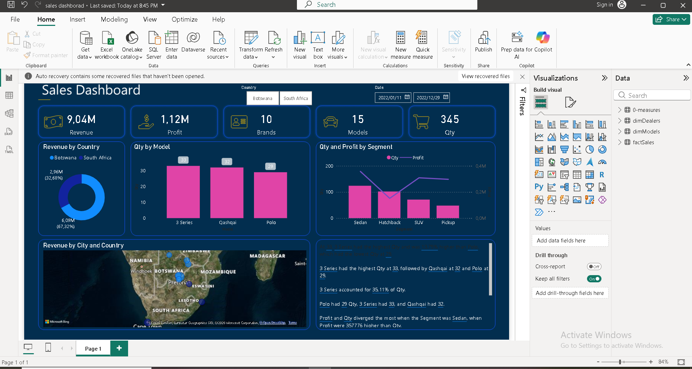

# Car Sales Dashboard (Southern Africa)

An interactive Power BI dashboard analyzing car sales performance across dealers, models, and market segments in Botswana and South Africa.

## Objective

Analyze car sales data from dealerships in Southern Africa to identify which models, segments, and locations drive revenue and profit — supporting decisions on inventory, pricing, and regional focus.

## Data

The dataset (`data/Top_Cars_Database_Africa.xlsx`) is a relational model with three tables:

- **Dealers** — dealer ID, name, city, and country
- **Models** — brand, model, segment, engine size, fuel type, price, and profit margin
- **Sales** — transaction-level records linking dealers and models, with quantity and calculated totals

Data spans January 2022 to December 2022.

## Key Insights

- **9.04M** total revenue and **1.12M** total profit across **345** units sold, spanning **10 brands** and **15 models**
- The **3 Series** was the top-selling model by quantity (33 units, 35.11% of total volume), followed by the **Qashqai** (32 units) and **Polo** (29 units)
- **Botswana** contributed **6.09M (67.32%)** of total revenue, while **South Africa** contributed **2.96M (32.68%)**
- **Profit and Quantity diverged most in the Sedan segment**, where profit outpaced quantity by 357,776
- The dashboard supports interactive filtering by country and date range, with drill-through enabled for deeper segment analysis

## Tools & Techniques

- **Power BI** — report building, data modeling, DAX measures
- **Power Query** — data transformation and cleaning
- **Excel** — source data with formula-driven calculated columns (profit margin, total price, total profit)
- Visuals used: KPI cards, donut chart, column chart, combo chart (bar + line), map, and a narrative insights panel

## Files

| File | Description |
|---|---|
| `CarSalesDashboard.pbix` | Full Power BI report file (open in Power BI Desktop) |
| `data/Top_Cars_Database_Africa.xlsx` | Source dataset (Dealers, Models, Sales tables) |
| `screenshots/dashboard-overview.png` | Static preview of the dashboard |

## How to View

1. Download `CarSalesDashboard.pbix`
2. Open in [Power BI Desktop](https://powerbi.microsoft.com/desktop/) (free)
3. Data will refresh from the linked Excel source, or you can point it to your own copy of `Top_Cars_Database_Africa.xlsx`

---
**Author:** Phooko Irvin Rakgetse
[LinkedIn](https://linkedin.com/in/irvin-rakgetse) · [Portfolio](https://phooko-folio-hub.lovable.app/) · [GitHub](https://github.com/irvinrakgetse02)
